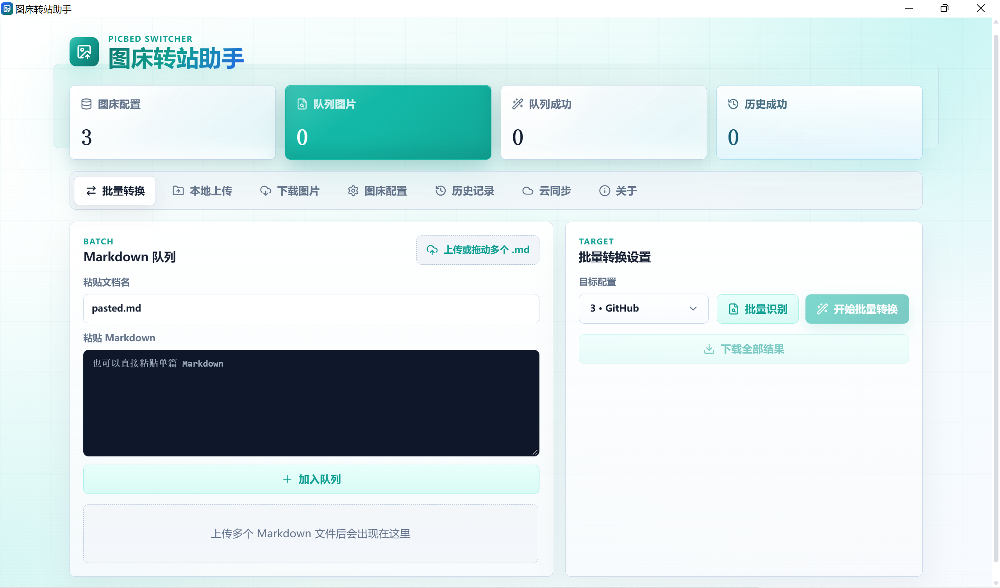

<div align="center">

<h1>PicBed Switcher Desktop</h1>

<p><b>Markdown image URL migration, on your desktop</b> — GitHub · Gitee · Tencent COS · Aliyun OSS · Qiniu · Baidu BOS · Huawei OBS · Upyun · MinIO · EasyImage</p>

<p><a href="README.md">简体中文</a> · <b>English</b></p>

Swapping image hosts means editing every Markdown document link by hand — one URL at a time.  
PicBed Switcher Desktop puts that batch-conversion power into a desktop app: a Rust + Tauri 2 core, a Vue 3 workspace and SQLite.  
One installer is all it takes — no login, no deployment, no open ports, fully usable offline.  
Your documents, conversion history and image-host credentials stay on your own disk; credentials are stored with AES-256-GCM encryption.

<p>
  <a href="LICENSE"></a>
  <a href="https://tauri.app/"></a>
  <a href="https://www.rust-lang.org/"></a>
  <a href="https://vuejs.org/"></a>
  <a href="https://www.sqlite.org/"></a>
</p>

<p>
  <b><a href="#preview">Preview</a></b> ·
  <a href="#what-it-does">What it does</a> ·
  <a href="#how-it-works">How it works</a> ·
  <a href="#tech-stack">Tech stack</a> ·
  <a href="#quick-start">Quick start</a> ·
  <a href="#build--install">Build &amp; install</a> ·
  <a href="#supported-image-hosts">Hosts</a> ·
  <a href="#data-and-security">Security</a> ·
  <a href="#faq">FAQ</a> ·
  <a href="#repository-layout">Layout</a> ·
  <a href="#documentation">Docs</a>
</p>

</div>

---

## Preview

### Workspace

| Desktop workspace (Convert / Local upload / Configs / Records) |
| :---: |
|  |

## What It Does

- **Multi-host support** — GitHub, Gitee, Tencent Cloud COS, Aliyun OSS, Qiniu Kodo, Baidu BOS, Huawei OBS, Upyun, MinIO and EasyImage, plus self-hosted services with generic upload APIs.
- **Document conversion** — Automatically detects image URLs and their hosts in uploaded Markdown; pick a target host and batch-convert in one click, then download the replaced document.
- **Local upload** — Detects local image references (relative paths, absolute paths, `` tags), uploads them to the target host and replaces them with remote URLs automatically.
- **Task queue** — Batch conversion and local upload both run as persisted tasks consumed by a background worker, with document-level concurrency (3) inside each task; queued tasks resume automatically after an app restart, with progress visible at any time.
- **Filename formatting** — Object paths support `{y}`, `{m}`, `{d}`, `{hash}`, `{random}`, `{rand:N}`, `{timestamp}` and more, for date folders, content hashes or custom templates.
- **Host configuration** — Add, edit, delete and test host configurations, with a default host; secrets are stored encrypted and masked in the UI.
- **Conversion history** — Records source/target hosts, status and image counts for every conversion, with batch deletion, search and time-range filters, plus per-image replacement details.
- **Image download** — Upload a Markdown containing remote images: all URLs are detected, labeled by host type, and can be batch-downloaded to a directory of your choice; duplicate names get a numeric suffix instead of overwriting.
- **Cloud sync** — Connect a private GitHub Gist and back up all image-host configurations encrypted with your sync password: changes auto-upload after 3 seconds, manual sync anytime, and Gist revisions can be browsed, previewed and restored in one click; on another device, connect and unlock with the same password to align. Only ciphertext ever reaches the cloud (zero-knowledge).
- **About page** — Card-based view of the app version with project, issue-feedback and release-notes entries, with one-click access to the repository; includes a built-in update checker that runs automatically on startup and installs new versions in-app with one click (Windows only, for both installer and portable builds; other platforms are guided to the releases page for manual download).
- **Single instance** — Launching the app again while it is already running silently exits the second instance — no window, no focus stealing.
- **GitHub acceleration** — Optionally download GitHub images through gh-proxy-style mirrors for better batch success rates.

**It is not** an image host itself, nor an image-compression or CDN tool: PicBed Switcher Desktop handles "batch migration and replacement of image URLs in documents" — it never proxies image traffic, caches images, or modifies originals.

The same host-swap scenario, side by side:

| Scenario | By hand | With PicBed Switcher Desktop |
| --- | --- | --- |
| Switching hosts | Edit every link in every document | Pick a target host, batch-convert once |
| Changing repo / domain | Find-and-replace is error-prone | Hosts and URLs are detected automatically |
| Local images | Upload manually, then edit links | Local upload replaces them with remote URLs |
| Progress | Half-done and lost track | Persisted queue keeps running across restarts |
| History | Nothing to look back at | Every replacement detail is recorded |
| Host credentials | Scattered across scripts | Stored AES-256-GCM encrypted in the local database |

## How It Works

```text
  ┌────────────────────────────────────────┐
│  Tauri window (system WebView)            │
│  Vue 3 workspace: convert · upload ·      │
│  configs · records                        │
└────────────────┬───────────────────────┘
                 │  Tauri IPC (invoke, no open ports)
                 ▼
┌────────────────────────────────────────┐
│  Rust core                               │
│  conversion engine · uploaders ·         │
│  AES-GCM encryption                      │
│  task queue (tokio mpsc + SQLite)        │
└────────────────┬───────────────────────┘
                 ▼
   SQLite (picbed.db in the app data dir)
```

- **Who does what** — The Vue workspace handles picking documents, choosing hosts and showing progress and results; document parsing, URL detection, image upload and replacement, and task scheduling all happen in the Rust core.
- **Where data lives** — SQLite is the source of truth for host configurations, conversion tasks and history; host secrets are stored AES-256-GCM encrypted with the same key derivation as the web edition.
- **Task queue** — Tasks are first persisted to SQLite, then fed into an in-memory queue consumed by a background worker, converting documents within a task concurrently (3 at a time); on startup, tasks still queued are re-enqueued automatically.
- **Network exposure** — Frontend and backend talk over Tauri IPC, so the app never listens on any TCP port; outbound HTTPS happens only when talking to image-host APIs.

## Tech Stack

| Layer | Choice |
| --- | --- |
| App framework | [Tauri 2](https://tauri.app/) (Rust core + system WebView) |
| Backend language | Rust 1.80+ (tokio async runtime) |
| Database | SQLite ([rusqlite](https://github.com/rusqlite/rusqlite), WAL mode) |
| Image upload | [reqwest](https://github.com/seanmonstar/reqwest) + self-implemented S3 SigV4 signing |
| Encryption | AES-256-GCM ([RustCrypto](https://github.com/RustCrypto)) |
| Frontend | Vue 3 + TypeScript |
| Build tool | [Vite](https://vite.dev/) |
| Icons | Lucide |
| Installers | NSIS (Windows), dmg (macOS), deb & rpm (Linux) |

## Quick Start

Local development requires **Rust 1.80+** and **Node.js 22+**; Windows ships with WebView2, while Linux needs WebKitGTK installed first.

```bash
git clone https://github.com/zyx3721/picsw-rust.git
cd picsw-rust
npm install
npm run tauri dev
```

The first run compiles the Rust core (a few minutes), then opens the app window; both frontend and Rust changes hot-reload.

On Linux, install system dependencies first:

```bash
sudo apt-get install libwebkit2gtk-4.1-dev build-essential curl wget file \
  libxdo-dev libssl-dev libayatana-appindicator3-dev librsvg2-dev
```

Checks and tests:

```bash
npm run type-check           # Frontend type check
cd src-tauri && cargo test   # Rust unit tests
```

## Build & Install

### Option 1: Download a Release installer (recommended)

Head to the [GitHub Releases](https://github.com/zyx3721/picsw-rust/releases) page and grab the installer for your OS and CPU architecture:

| Your machine | Download |
| --- | --- |
| Windows x86_64 | `PicBed Switcher_<version>_x64-setup.exe` |
| Windows ARM64 | `PicBed Switcher_<version>_arm64-setup.exe` |
| macOS Intel | `PicBed Switcher_<version>_x64.dmg` |
| macOS Apple silicon | `PicBed Switcher_<version>_aarch64.dmg` |
| Ubuntu / Debian desktop amd64 | `PicBed Switcher_<version>_amd64.deb` |
| Ubuntu / Debian desktop arm64 | `PicBed Switcher_<version>_arm64.deb` |
| Fedora / RHEL desktop amd64 | `picbed-switcher_<version>_amd64.rpm` |
| Fedora / RHEL desktop arm64 | `picbed-switcher_<version>_arm64.rpm` |
| Windows portable amd64 | `picbed-switcher_<version>_windows_amd64.zip` |
| Windows portable arm64 | `picbed-switcher_<version>_windows_arm64.zip` |
| macOS portable Intel | `picbed-switcher_<version>_macos_amd64.tar.gz` |
| macOS portable Apple silicon | `picbed-switcher_<version>_macos_arm64.tar.gz` |
| Linux portable amd64 | `picbed-switcher_<version>_linux_amd64.tar.gz` |
| Linux portable arm64 | `picbed-switcher_<version>_linux_arm64.tar.gz` |

Windows installers support `/S` silent installation; every installer is built by CI on its native architecture, and pushing a `v*` tag creates a Release with all artifacts attached.

### Option 2: Build from source

```bash
npm run tauri build
```

Artifacts land in `src-tauri/target/release/bundle/`: NSIS installers on Windows, dmg on macOS, deb and rpm on Linux (local rpm bundling requires `rpmbuild`).

## Supported Image Hosts

| Host | Required configuration |
| --- | --- |
| GitHub | Personal Access Token, repository |
| Gitee | Private Token, repository |
| Tencent Cloud COS | SecretId, SecretKey, bucket |
| Aliyun OSS | AccessKeyId, AccessKeySecret, bucket |
| Qiniu | AccessKey, SecretKey, bucket |
| Baidu BOS | AccessKeyId, SecretAccessKey, bucket, region |
| Huawei OBS | AccessKeyId, SecretAccessKey, bucket, region |
| Upyun | Service, operator, password, acceleration domain |
| MinIO | Endpoint, AccessKey, SecretKey, bucket (optional region, SSL, public domain) |
| EasyImage | API URL, Token |
| Other hosts | Any upload API with API URL + Token |

All hosts except EasyImage support a custom "filename format" with the variables: `{y}`, `{m}`, `{d}`, `{hash}`, `{origin}`, `{name}`, `{filename}`, `{ext}`, `{random}`, `{rand:N}`, `{timestamp}`; see the [User Guide](docs/manual.md) (Chinese) for the full reference and examples.

## Data & Security

```text
Open the app and go — no login
        +
Image-host tokens/keys stored AES-256-GCM encrypted, masked in the UI
        +
Frontend and backend talk over Tauri IPC — no TCP ports listened on
        +
Everything stays in the local app data directory, ready to back up
```

- **All data is local** — Configurations, tasks and history live in the app data directory (`%APPDATA%\com.picsw.desktop\picbed.db` on Windows); no business data is ever uploaded.
- **Encrypted secrets** — Image-host tokens/secret keys are stored encrypted and masked when displayed.
- **Zero-knowledge cloud sync** — Cloud sync covers image-host configurations only: they are encrypted with a key derived from your sync password (AES-256-GCM) before reaching a private GitHub Gist, so the cloud only ever holds ciphertext. The sync password is never stored, and the GitHub token lives in the OS keychain (falling back to a machine-bound encrypted file when unavailable). Connecting supports device authorization flow (see the [GitHub OAuth App & Device Flow Guide](docs/github-oauth-device-flow.md)) or a personal access token.
- **Regular backups** — Close the app and back up `picbed.db` (plus its `-wal` / `-shm` files) from the app data directory.

## FAQ

**What if a conversion fails?**

Check in order: host configuration, token/secret validity, network connectivity, and host API rate limits; the error summary in the record details gives the specific cause.

**How do I back up data?**

Close the app and back up `picbed.db` (and its `-wal` / `-shm` files); to migrate, restore the backup into the same directory on the new machine.

**Which local image references are supported?**

Relative paths (`./images/a.png`, `images/a.png`), Windows absolute paths and `` tags; `http://` / `https://` remote URLs are kept as-is — use batch conversion to rewrite remote URLs.

**Is data shared with the web edition?**

Host configurations use the same encryption as the web edition, but storage differs (PostgreSQL there, SQLite here); there is no direct migration tool yet — simply re-add your host configurations in the desktop app.

## Repository Layout

```text
picsw-rust/
├── src-tauri/                Rust backend & Tauri configuration
│   ├── src/
│   │   ├── lib.rs            App entry & command registration
│   │   ├── main.rs           Executable entry
│   │   ├── commands/         Tauri command layer (configs / convert / files / updates)
│   │   ├── engine.rs         Conversion engine (remote & local upload)
│   │   ├── uploader/         Image-host uploaders (S3 SigV4 / REST / USS)
│   │   ├── task_queue.rs     Task-queue worker & local task files
│   │   ├── markdown.rs       Image extraction / host detection / URL replacement
│   │   ├── crypto.rs         AES-256-GCM config encryption
│   │   ├── db.rs             SQLite connection & schema
│   │   ├── models.rs         Data models
│   │   ├── types_def.rs      Image-host metadata
│   ├── icons/                App icons and installer images (source image: app-icon.png)
│   ├── tauri.conf.json       Tauri bundling & window configuration
│   └── Cargo.toml
├── src/                      Vue 3 frontend
│   ├── components/           Workspace panels & dialogs
│   ├── composables/          State orchestration
│   │   └── workspace/        Convert / local upload / configs modules (request.ts is the IPC layer)
│   ├── App.vue               Root component
│   ├── main.ts               Frontend entry
│   └── style.css             Global styles
├── public/                   Static assets (favicon)
├── .env.example              Cloud-sync client_id config sample (copy to .env)
├── .github/                  GitHub Actions workflows & preview images
├── LICENSE
├── README.md                 简体中文
└── README.en.md              English (this file)
```

## Documentation

| Start here | Then read on |
| --- | --- |
| [Quick start](#quick-start) | Get a dev environment running |
| [Build & install](#build--install) | Download installers or build from source |
| [User Guide](docs/manual.md) | Detailed usage & filename format (Chinese) |
| [GitHub OAuth App & Device Flow Guide](docs/github-oauth-device-flow.md) | Device-flow setup for cloud sync |
| [中文 README](README.md) | 同样的内容，中文版 |

## Release Notes

| Version | Date | Changelog |
| --- | --- | --- |
| v1.0.0 | 2026-09-29 | [verchanglog/v1.0.0.md](verchanglog/v1.0.0.md) |
| v1.1.0 | 2026-09-30 | [verchanglog/v1.1.0.md](verchanglog/v1.1.0.md) |
| v1.1.1 | 2026-09-30 | [verchanglog/v1.1.1.md](verchanglog/v1.1.1.md) |

Build artifacts and release notes for each version are available on the [GitHub Releases](https://github.com/zyx3721/picsw-rust/releases) page.

## Acknowledgements

Thanks to the following open-source projects and communities:

- [Tauri](https://tauri.app/) — Cross-platform desktop app framework
- [rusqlite](https://github.com/rusqlite/rusqlite) — SQLite bindings for Rust
- [reqwest](https://github.com/seanmonstar/reqwest) — HTTP client for Rust
- [RustCrypto](https://github.com/RustCrypto) — AES-GCM and other crypto implementations
- [Vue](https://vuejs.org/) — Progressive JavaScript framework
- [Vite](https://vite.dev/) — Fast frontend build tool
- [Lucide](https://lucide.dev/) — Consistent open-source icon library
- [picbed-switcher](https://github.com/zyx3721/picbed-switcher) — The web edition this project originates from

Thanks also to everyone who contributed code, suggestions and bug reports.

## License

This project is released under the [MIT License](LICENSE). You are free to use, copy, modify, merge, publish, distribute, sublicense and sell it, provided the copyright and permission notices are included in all copies or substantial portions.

## Contact

- **Email**: 416685476@qq.com
- **GitHub Issues**: [zyx3721/picsw-rust/issues](https://github.com/zyx3721/picsw-rust/issues)
- **Project Home**: [github.com/zyx3721/picsw-rust](https://github.com/zyx3721/picsw-rust)

---

**⭐ If this project helps you, please consider giving it a star!**
